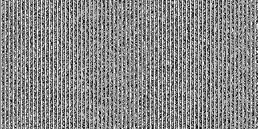

To start generating a stream of random characters use:
1. `node stringGenerator.js` in your terminal;
2. Remember to `CONTROL + C` process manually after some time to prevent running out of disk space (files can get large quickly);

### Abstract

Here is a [thread](https://twitter.com/crackingBunker/status/1203682647475728384) I posted on Twitter that succintly explains the rationale for creating this small script.
It is not so much an exploration of code but a participatory exploration of randomness, reality and information through finite means / steps. 

Leave some monkeys typing on a typewriter and soon they will re-invent Shakespeare. Is it so? 
How can a file contain in it what you ate today, the day of your marriage or even a few sentences from Shakespeare? 
It can only do so in the presence of someone observing the output (hence participatory). The stream does not know of its past (unless captured through storing the bytes in a text file) nor future.
But it's rapidly expanding with each new write stream iteration. Indeed, `while monkeys can type` anything that can happen will happen, and everything that has ever happened will be logged for eternity.
Much like our Universe (which I believe is digital), converging towards limit of spacetime, the information as it grows has no reason not to be more than the sum of its parts. Want to wrtei Shakespeare, or have the bite representation of your selfie that you took today? Leave the stringGenerator crunching and at some point it will happen. Again, and again and again. 
We can only be active at the outskirts of present and the rest is just a tail. We are observing ourselves and can't think or feel that it is different. By looking at the Universe, reaching far to the galaxies and stars and through the dark matter of space, we are learning to look in the mirror of the information system that we live in. A digital Universe that has not other option than output the log for whoever writer, author needs to experience life. And manifest itself.

## UTF-8 encoded string visualisation of > 10,000 characters

